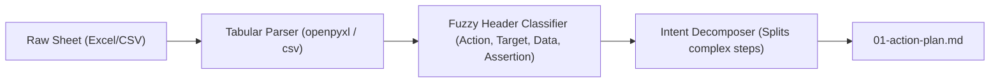
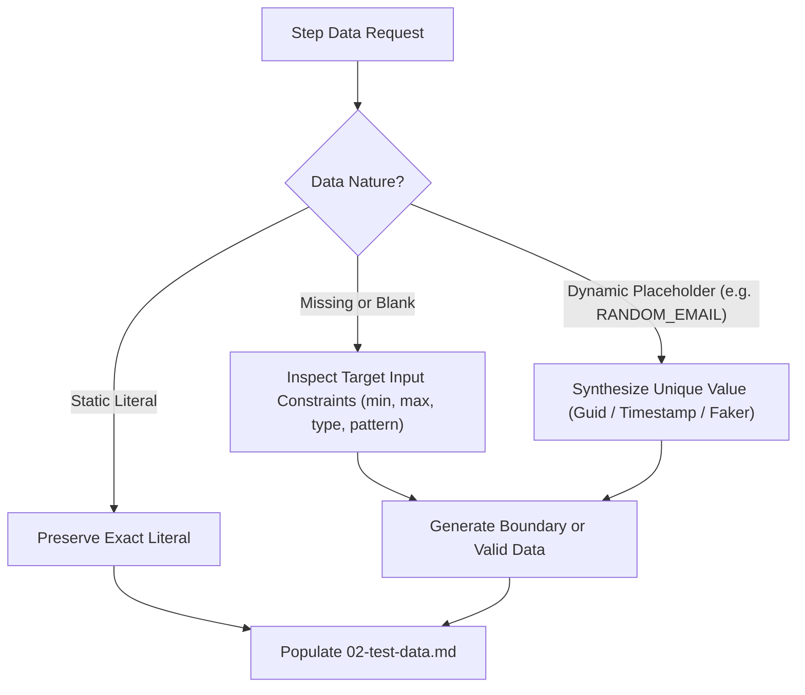
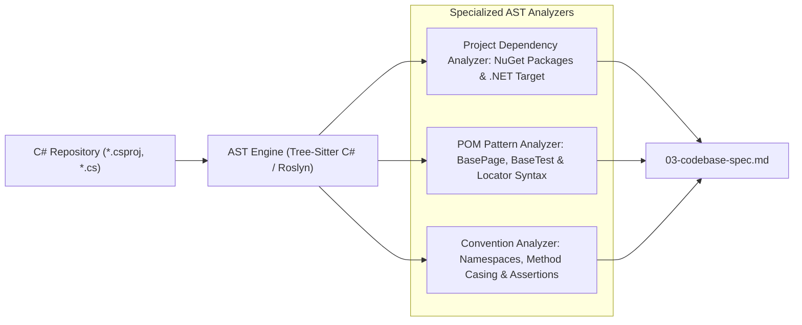
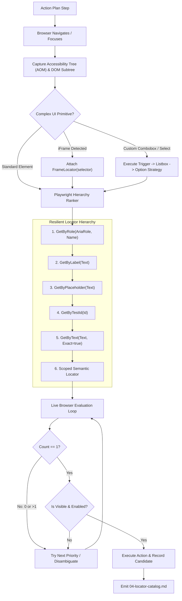
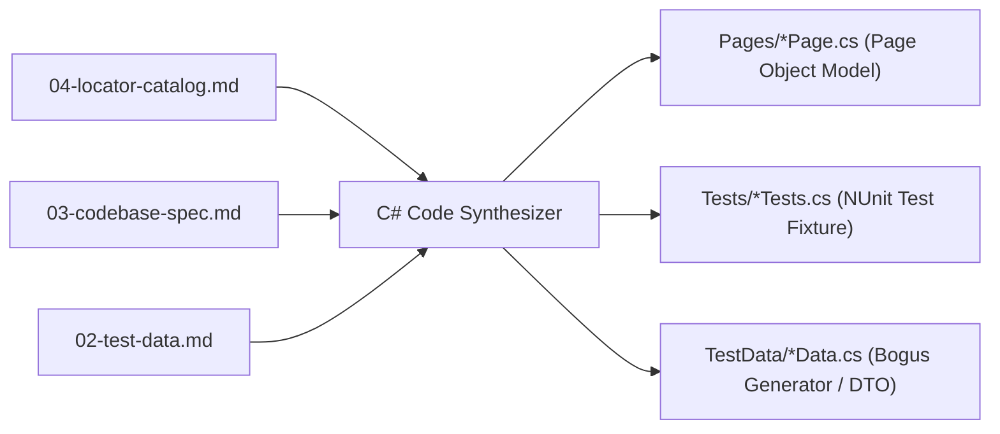
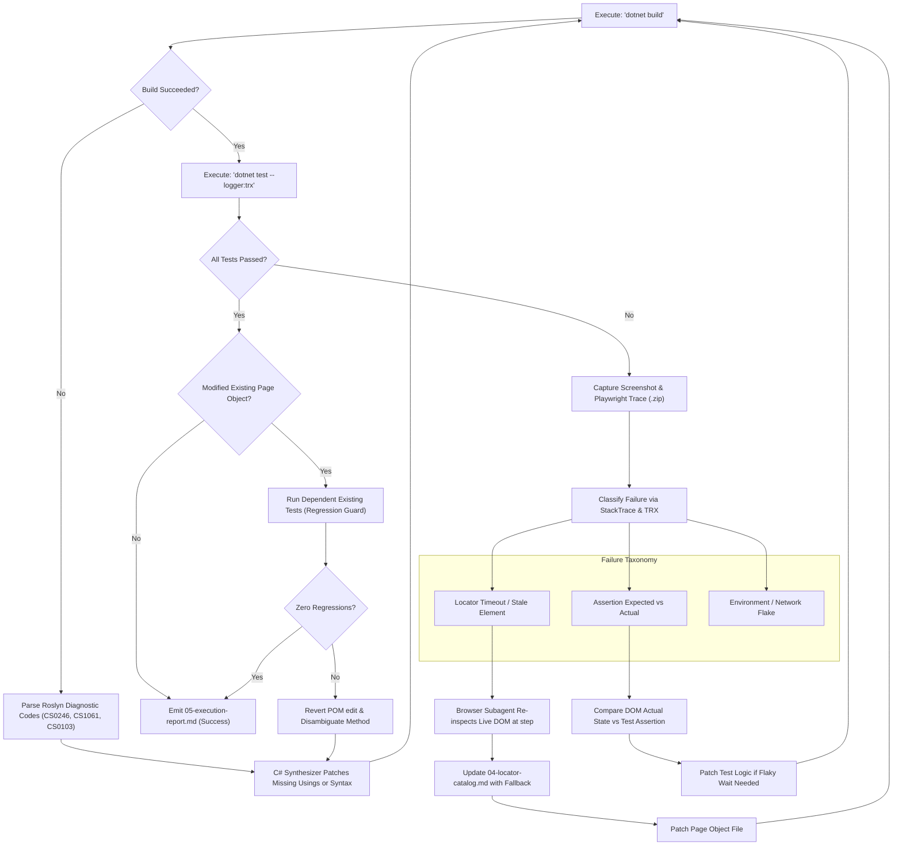
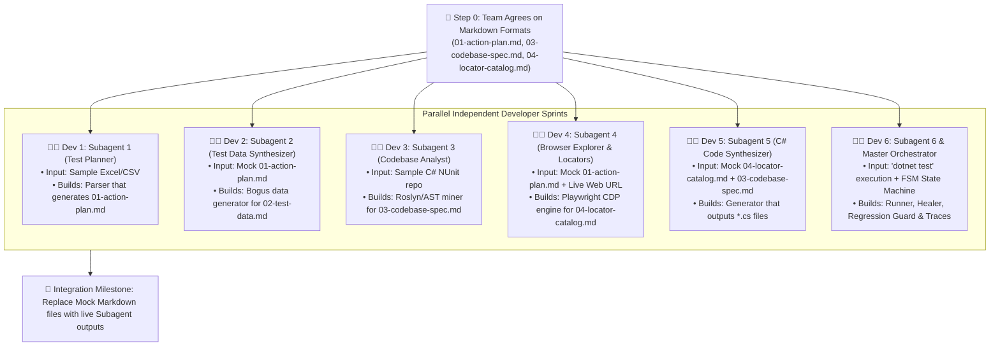
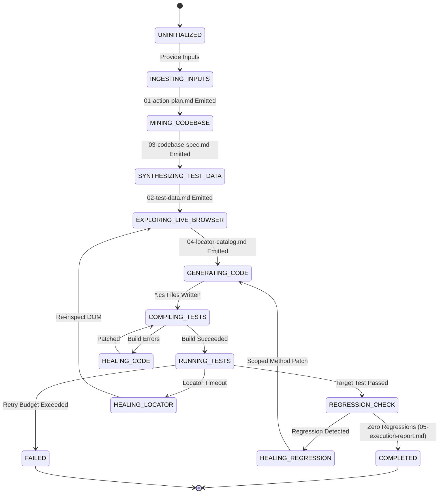

# 🛠️ Autonomous SDET Agent: Detailed Architecture Overview

> **Deep-Dive Technical Specification & Component Engineering Guide**  
> *Target Framework: C# .NET | Playwright for .NET | NUnit | Page Object Model (POM)*  
> *Protocol: Markdown-First Agent Artifacts (`.md`)*

---

## Table of Contents
1. [System Philosophy & Design Principles](#1-system-philosophy--design-principles)
2. [The Markdown Artifact Contracts](#2-the-markdown-artifact-contracts)
3. [Subagent 1: Test Ingestion & Planner](#3-subagent-1-test-ingestion--planner)
4. [Subagent 2: Test Data Synthesizer](#4-subagent-2-test-data-synthesizer)
5. [Subagent 3: Codebase Analyst (Roslyn / Tree-Sitter AST Miner)](#5-subagent-3-codebase-analyst-roslyn--tree-sitter-ast-miner)
6. [Subagent 4: Browser Explorer & Resilient Locator Engine](#6-subagent-4-browser-explorer--resilient-locator-engine)
   * [6.1. Interactive Exploration Loop](#61-interactive-exploration-loop)
   * [6.2. Playwright Resilient Locator Ranking Matrix](#62-playwright-resilient-locator-ranking-matrix)
   * [6.3. Complex UI Primitives Engine (Shadow DOM, iFrames & Comboboxes)](#63-complex-ui-primitives-engine-shadow-dom-iframes--comboboxes)
7. [Subagent 5: C# Code Synthesizer](#7-subagent-5-c-code-synthesizer)
8. [Subagent 6: Test Runner & Autonomous Self-Healer](#8-subagent-6-test-runner--autonomous-self-healer)
   * [8.1. Diagnostic & Healing Architecture](#81-diagnostic--healing-architecture)
   * [8.2. Shared Page Object Regression Guard](#82-shared-page-object-regression-guard)
   * [8.3. Visual Evidence & Playwright Trace Bundling](#83-visual-evidence--playwright-trace-bundling)
9. [Parallel Team Development & Workstream Breakdown](#9-parallel-team-development--workstream-breakdown)
10. [Master Orchestrator State Machine](#10-master-orchestrator-state-machine)
11. [Infrastructure, Deployment & Runtime Topology](#11-infrastructure-deployment--runtime-topology)

---

## 1. System Philosophy & Design Principles

The Autonomous SDET Agent operates on six core architectural invariants:

1. **Markdown-First Artifact Communication**:  
   Instead of fragile, bracket-heavy JSON pipes that frequently fail on escaped quotes in C# code, subagents communicate via **standardized Markdown (`.md`) artifacts** stored in an `artifacts/` workspace. This cuts token consumption by ~35%, eliminates quote-escaping syntax errors, and creates a human-readable audit trail.
2. **Context-Window Isolation via Specialized Subagents**:  
   Web DOM trees and compiler logs generate tens of thousands of tokens. Subagents isolate this high-entropy data, ensuring that the central code generator only receives curated, compact Markdown contracts.
3. **Complex UI Primitive Resilience**:  
   Enterprise applications do not rely on standard HTML. The agent includes specialized interaction strategies for **Shadow DOM**, **nested iFrames**, **custom comboboxes (Select2, Radix)**, and **file uploads**.
4. **Empirical Verification Over Generative Hallucination**:  
   No selector or test action is accepted on faith. Every element locator is live-evaluated in an active browser session to prove `count == 1`, `isVisible == true`, and `isEnabled == true`.
5. **Shared Page Object Regression Guard**:  
   When modifying an existing Page Object class, the agent automatically executes all existing dependent tests to guarantee that new additions never break previously passing tests.
6. **Closed-Loop Self-Healing with Visual Evidence**:  
   The agent executes `dotnet build` and `dotnet test`, automatically heals locators or syntax upon failure, and bundles full **Playwright Traces (`trace.zip`)** and **failure screenshots** for post-mortem analysis.

---

## 2. The Markdown Artifact Contracts

All inter-agent communication flows through five standardized Markdown files inside the `artifacts/` directory:

```
artifacts/
├── 01-action-plan.md          # Emitted by Subagent 1 (Test Planner)
├── 02-test-data.md            # Emitted by Subagent 2 (Test Data Synthesizer)
├── 03-codebase-spec.md        # Emitted by Subagent 3 (Codebase Analyst)
├── 04-locator-catalog.md      # Emitted by Subagent 4 (Browser Explorer)
├── 05-execution-report.md     # Emitted by Subagent 6 (Test Runner & Healer)
├── screenshots/               # Visual evidence directory
│   └── TC_AUTH_001_failure.png
└── traces/                    # Playwright trace logs
    └── TC_AUTH_001_trace.zip
```

---

### 2.1. `artifacts/01-action-plan.md`
*Emitted by Subagent 1 $\rightarrow$ Consumed by Subagent 2, 4, & 5.*

````markdown
# 📋 Test Action Plan: TC_AUTH_001
**Title:** Valid User Login and Dashboard Redirection  
**Target URL:** `https://staging.example.com/login`  
**Description:** Verify registered user can successfully authenticate and reach the main dashboard.

## Action Steps

| Step | Action | Semantic Target | Role / Accessible Name | Test Data Reference | Expected Outcome |
| :---: | :--- | :--- | :--- | :--- | :--- |
| **1** | `NAVIGATE` | LoginPage | — | `https://staging.example.com/login` | Page loads with 200 OK |
| **2** | `TYPE` | UsernameInput | `textbox` "Username or Email" | `{{DATA:VALID_USER_EMAIL}}` | Value populated |
| **3** | `TYPE` | PasswordInput | `textbox` "Password" | `{{DATA:VALID_USER_PASSWORD}}` | Value masked |
| **4** | `CLICK` | SignInButton | `button` "Sign In" | — | Form submitted |
| **5** | `ASSERT_VISIBLE` | DashboardHeader | `heading` "Welcome to your Dashboard" | — | Header visible |
````

---

### 2.2. `artifacts/02-test-data.md`
*Emitted by Subagent 2 $\rightarrow$ Consumed by Subagent 4 & 5.*

````markdown
# 🎲 Test Data Model: TC_AUTH_001

## Resolved Values
| Key | Type | Value | Generation Strategy |
| :--- | :--- | :--- | :--- |
| `VALID_USER_EMAIL` | `email` | `alpha_tester_2026@domain.com` | Resolved from test case sheet |
| `VALID_USER_PASSWORD` | `password` | `SecureAuth#2026!` | Static credential from secret config |
| `NEW_REGISTRATION_EMAIL` | `email` | `user_1710002123_a9b1@test.com` | Dynamic unique (Bogus Faker) |

## C# Bogus Generation Rule
```csharp
public static Faker<UserDto> UserFaker => new Faker<UserDto>()
    .RuleFor(u => u.Email, f => f.Internet.Email(f.Person.FirstName, f.Random.AlphaNumeric(6)))
    .RuleFor(u => u.Password, f => f.Internet.Password(12, true));
```
````

---

### 2.3. `artifacts/03-codebase-spec.md`
*Emitted by Subagent 3 $\rightarrow$ Consumed by Subagent 5.*

````markdown
# 🏛️ Codebase Architectural Styleguide
*Extracted from target repository via Roslyn AST analysis.*

## Project Coordinates
* **Project File:** `Enterprise.Automation.csproj`
* **Target Framework:** `net8.0`
* **Root Namespace:** `Enterprise.Automation.Tests`
* **Page Object Directory:** `Pages/`
* **Test Fixtures Directory:** `Tests/`

## Architecture Patterns
* **Base Page Class:** `BasePage` (`using Enterprise.Automation.Tests.Pages;`)
* **Base Test Class:** `BaseTest` (`using Enterprise.Automation.Tests.Infrastructure;`)
* **Test Runner:** `NUnit` (`Microsoft.Playwright.NUnit`)
* **Assertion Style:** `FluentAssertions` & Playwright `Expect()`

## Coding Conventions
1. **Locators:** Expose as expression-bodied properties:
   ```csharp
   public ILocator SignInButton => Page.GetByRole(AriaRole.Button, new() { Name = "Sign In" });
   ```
2. **Constructors:** Inherit from `BasePage`:
   ```csharp
   public LoginPage(IPage page) : base(page) { }
   ```
3. **Action Methods:** Return next Page Object (Fluent Page Object Model):
   ```csharp
   public async Task<DashboardPage> ClickSignInAsync()
   ```
````

---

### 2.4. `artifacts/04-locator-catalog.md`
*Emitted by Subagent 4 $\rightarrow$ Consumed by Subagent 5 & 6.*

````markdown
# 🔍 Verified Locator Catalog: LoginPage
**URL Pattern:** `.*/login`  
**Live Browser Verified:** ✅ Yes (`count == 1`, `visible == true`, `enabled == true`)

## Elements

### `UsernameInput`
* **Primary Locator (ARIA Role):**
  ```csharp
  Page.GetByRole(AriaRole.Textbox, new() { Name = "Username or Email" })
  ```
* **Fallback 1 (Label):**
  ```csharp
  Page.GetByLabel("Username or Email")
  ```
* **Fallback 2 (CSS):**
  ```csharp
  Page.Locator("#username")
  ```

### `PaymentFrame` *(Complex UI Primitive)*
* **Frame Locator:**
  ```csharp
  Page.FrameLocator("iframe#stripe-checkout-frame")
  ```
* **Child Element Inside Frame:**
  ```csharp
  PaymentFrame.GetByRole(AriaRole.Textbox, new() { Name = "Card number" })
  ```
````

---

### 2.5. `artifacts/05-execution-report.md`
*Emitted by Subagent 6 $\rightarrow$ Consumed by Master Orchestrator & User.*

````markdown
# 🛡️ Test Execution & Self-Healing Report: TC_AUTH_001

## Run Summary
* **Status:** ✅ PASSED
* **Compilation:** Succeeded (0 warnings, 0 errors)
* **Total Executed:** 1
* **Passed:** 1
* **Failed:** 0
* **Healing Iterations Used:** 1 of 3
* **Shared POM Regression Check:** ✅ PASSED (3 dependent tests re-verified without regression)

## Visual Evidence & Debugging
* **Failure Screenshot (Captured during iteration 1):**  
  
* **Playwright Interactive Trace:**  
  [Open Playwright Trace Viewer](traces/TC_AUTH_001_trace.zip) (`playwright show-trace artifacts/traces/TC_AUTH_001_trace.zip`)

## Self-Healing Log
* **Iteration 1**:
  * *Failure*: `TimeoutException` on `SignInButton` using initial selector `Page.GetByText("Log In")`.
  * *Diagnosis*: Live button label was dynamically changed to `"Sign In"`.
  * *Healed Action*: Browser Subagent re-inspected DOM, extracted `Page.GetByRole(AriaRole.Button, new() { Name = "Sign In" })`, patched `LoginPage.cs`.
  * *Regression Guard*: Executed `dotnet test --filter "FullyQualifiedName~LoginPage"` to verify `TC_AUTH_000_ForgotPassword` still passes.
  * *Re-run*: `dotnet test` passed cleanly in 1.84 seconds.
````

---

## 3. Subagent 1: Test Ingestion & Planner

### 3.1. Overview
Transforms heterogeneous tabular test sheets (`.xlsx`, `.csv`, `.tsv`) into `artifacts/01-action-plan.md`.



### 3.2. Detailed Mechanics
1. **Fuzzy Header Mapping**:
   Human test sheets use arbitrary headers. The mapper uses token-similarity heuristics and LLM semantic classification:
   * **Step ID**: `Test ID`, `TC_ID`, `Step #`, `Case Number`
   * **Action/Step**: `Step Description`, `Action`, `User Action`, `Steps to Reproduce`
   * **Test Data**: `Input Data`, `Data`, `Test Values`, `Parameters`
   * **Expected Result**: `Expected Result`, `Verification`, `Validation`, `Outcome`
2. **Compound Action Decomposition**:
   A single step often says: *"Navigate to https://example.com, enter admin@domain.com into email, and click Login"*.  
   The Intent Decomposer splits this into three atomic operations:
   * `OP 1`: `NAVIGATE` $\rightarrow$ `https://example.com`
   * `OP 2`: `TYPE` $\rightarrow$ Target: `Email`, Data: `admin@domain.com`
   * `OP 3`: `CLICK` $\rightarrow$ Target: `Login button`

---

## 4. Subagent 2: Test Data Synthesizer

### 4.1. Overview
Resolves test data requirements, generates dynamic values, solves form validation constraints, and constructs `artifacts/02-test-data.md`.



---

## 5. Subagent 3: Codebase Analyst (Roslyn / Tree-Sitter AST Miner)

### 5.1. Overview
Performs static code analysis across the user's existing C# repository to produce `artifacts/03-codebase-spec.md`.



---

## 6. Subagent 4: Browser Explorer & Resilient Locator Engine

### 6.1. Interactive Exploration Loop



### 6.2. Playwright Resilient Locator Ranking Matrix

| Rank | Playwright C# Method | Rationale | Example Generated C# |
| :---: | :--- | :--- | :--- |
| **1** | `Page.GetByRole(AriaRole, Options)` | Closest to user perception; resilient to CSS/DOM refactors. | `Page.GetByRole(AriaRole.Button, new() { Name = "Submit" })` |
| **2** | `Page.GetByLabel(Text)` | Ideal for form inputs associated with `<label>`. | `Page.GetByLabel("Email Address")` |
| **3** | `Page.GetByPlaceholder(Text)` | Reliable fallback when labels are absent in modern inputs. | `Page.GetByPlaceholder("Enter your password")` |
| **4** | `Page.GetByTestId(Id)` | Explicit testing contract (`data-testid`, `data-cy`). | `Page.GetByTestId("checkout-btn")` |
| **5** | `Page.GetByText(Text)` | Great for non-interactive elements, badges, alerts. | `Page.GetByText("Order Confirmed", new() { Exact = true })` |
| **6** | `Page.Locator("parent").Locator("child")` | Scoped disambiguation when identical elements exist across cards/rows. | `Page.Locator(".card").Filter(new() { HasText = "Pro Plan" }).GetByRole(AriaRole.Button)` |

### 6.3. Complex UI Primitives Engine (Shadow DOM, iFrames & Comboboxes)

Enterprise web applications rarely use pure HTML `<select>` or standard top-level documents. Subagent 4 includes specialized strategies:

#### A. Nested iFrame Handling
When an element resides within an embedded frame (e.g. payment portals, reCAPTCHA widgets, sandboxed embeds):
1. Detects `<iframe>` parent hierarchy via CDP.
2. Generates scoped `FrameLocator`:
   ```csharp
   public IFrameLocator PaymentFrame => Page.FrameLocator("iframe#stripe-checkout");
   public ILocator CardInput => PaymentFrame.GetByRole(AriaRole.Textbox, new() { Name = "Card number" });
   ```

#### B. Shadow DOM Piercing
Playwright pierces open Shadow DOM trees by default with CSS and text locators. For custom web components:
1. Validates that shadow roots are open.
2. Scopes actions through component boundary tags:
   ```csharp
   Page.Locator("user-profile-widget").GetByRole(AriaRole.Button, new() { Name = "Edit Profile" });
   ```

#### C. Custom Dropdowns & Comboboxes (Select2, Radix, AntDesign)
Modern custom dropdowns render dynamic floating panels outside their parent `div`:
1. **Trigger Click**: Clicks the visible combobox button (`GetByRole(AriaRole.Combobox)`).
2. **Panel Wait**: Waits for floating `AriaRole.Listbox` portal to become visible.
3. **Option Selection**: Selects `GetByRole(AriaRole.Option, new() { Name = "OptionText" })`.
4. Synthesizes a composite method in the Page Object:
   ```csharp
   public async Task SelectCountryAsync(string country)
   {
       await CountryDropdown.ClickAsync();
       await Page.GetByRole(AriaRole.Option, new() { Name = country }).ClickAsync();
   }
   ```

#### D. Native File Uploads
Detects `<input type="file">` (even if hidden with `display: none`):
```csharp
await FileInput.SetInputFilesAsync("TestData/sample-upload.pdf");
```

---

## 7. Subagent 5: C# Code Synthesizer

### 7.1. Overview
Reads `03-codebase-spec.md` and `04-locator-catalog.md` and writes idiomatic C# files directly to the repository.



---

## 8. Subagent 6: Test Runner & Autonomous Self-Healer

### 8.1. Diagnostic & Healing Architecture



### 8.2. Shared Page Object Regression Guard
* **The Challenge**: When Subagent 5 patches `LoginPage.cs` to add or update an element for `TC_AUTH_015`, there is a risk of breaking `TC_AUTH_001` which also relies on `LoginPage.cs`.
* **The Solution**:
  1. Subagent 3 builds an in-memory **Dependency Graph** linking Page Objects to all Test Fixtures that instantiate them.
  2. Whenever an existing `*Page.cs` file is modified, Subagent 6 identifies all consumer tests.
  3. Executes a targeted regression run:
     ```bash
     dotnet test --filter "FullyQualifiedName~LoginPage"
     ```
  4. If any existing test fails, the agent detects the regression immediately, rolls back the breaking change, and generates a scoped method overload instead of mutating the existing contract.

### 8.3. Visual Evidence & Playwright Trace Bundling
Whenever a test execution fails during the self-healing loop:
1. **Failure Screenshot**: Automatically captured and saved to `artifacts/screenshots/{testCaseId}_failure.png`.
2. **Playwright Trace Archive**: Tracing is initiated before test runs:
   ```csharp
   await Context.Tracing.StartAsync(new() { Screenshots = true, Snapshots = true, Sources = true });
   // ... run test ...
   await Context.Tracing.StopAsync(new() { Path = "artifacts/traces/TC_AUTH_001_trace.zip" });
   ```
3. **Execution Report Integration**: The failure screenshot is embedded directly into `artifacts/05-execution-report.md` alongside instructions to inspect the trace (`playwright show-trace artifacts/traces/TC_AUTH_001_trace.zip`).

---

## 9. Parallel Team Development & Workstream Breakdown

Because all subagents interface via **Markdown Artifacts**, different engineers can build each component simultaneously without waiting for one another:



### Developer Responsibilities & Isolation Strategy

| Workstream | Assigned Developer | Isolated Testing Strategy (Mock Files) |
| :--- | :--- | :--- |
| **Subagent 1 (Planner)** | Dev 1 | Unit tests run against sample spreadsheets; asserts output equals `mock-01-action-plan.md`. |
| **Subagent 2 (Data Gen)** | Dev 2 | Unit tests read `mock-01-action-plan.md`; asserts output equals `mock-02-test-data.md`. |
| **Subagent 3 (AST Miner)** | Dev 3 | Tests run against a sample C# repo fixture; asserts output equals `mock-03-codebase-spec.md`. |
| **Subagent 4 (Browser)** | Dev 4 | Tests read `mock-01-action-plan.md` and navigate real URLs (handling iFrames/comboboxes); asserts output equals `mock-04-locator-catalog.md`. |
| **Subagent 5 (C# Synthesizer)** | Dev 5 | Tests read `mock-03-codebase-spec.md` and `mock-04-locator-catalog.md`; asserts output files compile with `dotnet build`. |
| **Subagent 6 (Runner/Healer)** | Dev 6 | Tests intentionally broken C# tests to verify diagnostic parsing, TRX report parsing, screenshot/trace capture, and regression checking. |

---

## 10. Master Orchestrator State Machine

The supervisor agent tracks execution using a deterministic Finite State Machine (FSM):



---

## 11. Infrastructure, Deployment & Runtime Topology

The SDET Agent is engineered as a **Hybrid Core**:

```
+---------------------------------------------------------------------------------+
|                                Runtime Options                                  |
+---------------------------------------+-----------------------------------------+
| Mode A: Developer CLI Tool            | Mode B: Enterprise Containerized Service|
|---------------------------------------|-----------------------------------------|
| • Runs on local dev machine           | • REST & WebSocket Gateway (FastAPI)    |
| • Accesses local C# repo directly     | • Task Queue (Celery / BullMQ / Redis)  |
| • Connects to local Chrome / Edge     | • Ephemeral Worker Pods (Docker / K8s)  |
| • Runs local 'dotnet test'            | • Headless Chromium sandbox + .NET SDK  |
| • Zero infrastructure required        | • Automatic Git Branch & PR creation    |
+---------------------------------------+-----------------------------------------+
```

### Key Security & Sandboxing Policies
1. **Isolated Browser Contexts**: Every test exploration runs in a pristine, isolated browser context (`Browser.NewContextAsync()`) to prevent cookie or cache contamination.
2. **Read-Only Inspection**: Codebase exploration is strictly read-only until the C# Code Synthesizer explicitly creates or patches verified files.
3. **Secret Masking**: Sensitive credentials provided in configuration (passwords, API tokens) are masked in all logs and action traces.

---

*Authored for the Autonomous SDET Engineering Initiative.*
