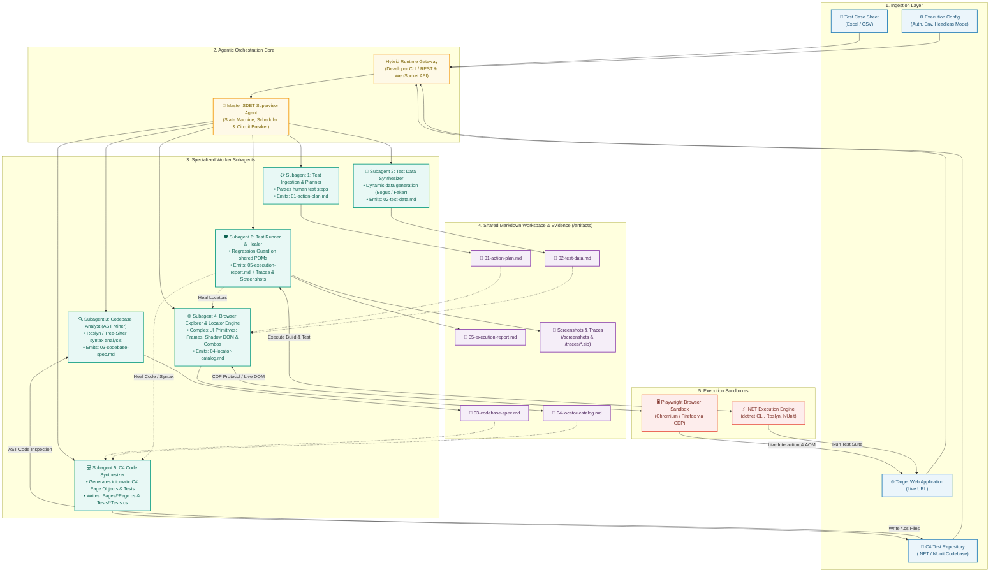
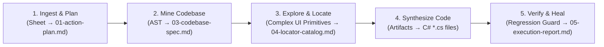
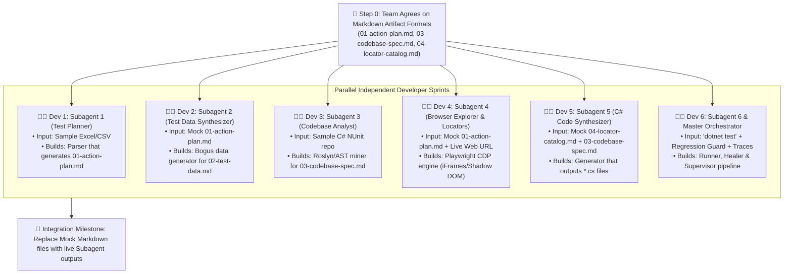

# 🚀 Autonomous SDET Agent: High-Level Architecture

> **An Autonomous Multi-Agent System for End-to-End Test Automation Engineering**  
> *From Tabular Test Cases to Production-Ready, Self-Healed C# Playwright NUnit Suites.*

---

## Executive Summary

The **Autonomous SDET Agent** is an enterprise-grade, multi-agent AI system designed to eliminate the manual overhead of authoring and maintaining automated browser test suites. 

By accepting four simple inputs:
1. **Test Case Sheet** (`.xlsx`, `.csv`)
2. **Target Web Application URL** (Staging, Pre-Prod, or Production)
3. **Target C# Automation Repository** (Existing .NET / NUnit codebase)
4. **Execution Configuration** (Credentials, Environment variables, Browser modes)

The system orchestrates a team of specialized worker subagents communicating via **Markdown-First Artifacts (`.md`)**. Built to withstand enterprise web applications, the architecture includes dedicated engines for **Complex UI Primitives (Shadow DOM, nested iFrames, dynamic comboboxes)**, a **Shared Page Object Regression Guard**, and **Playwright Trace/Screenshot Visual Evidence** for instant post-mortem debugging.

---

## 🎯 Core Value Proposition

```
┌───────────────────────────┐      ┌───────────────────────────┐      ┌───────────────────────────┐
│   Markdown-First Design   │      │   Complex UI Primitives   │      │  Zero-Regression Healing  │
│ Clean .md artifacts avoid │ ───► │ Native iFrames, Shadow    │ ───► │ Regression Guard re-tests │
│ escaping bugs and enable  │      │ DOM & custom combobox     │      │ shared POMs with bundled  │
│ parallel team sprints.    │      │ interaction strategies.   │      │ traces & screenshots.     │
└───────────────────────────┘      └───────────────────────────┘      └───────────────────────────┘
```

---

## 🏛️ System Architecture Topology



---

## 🔄 The 5-Phase Markdown Lifecycle



### Phase 1: Ingestion & Data Preparation
* Parses arbitrary test sheets using semantic mapping.
* Normalizes human-written steps into `01-action-plan.md`.
* Resolves dynamic placeholders (unique emails, boundary dates) into `02-test-data.md` using **Bogus**.

### Phase 2: Codebase Architectural Mining
* Performs static syntax analysis (Roslyn / Tree-sitter) on the existing C# repository.
* Discovers existing **BasePage**, **PageTest**, namespace structures, locator property formats, and builds a dependency graph of existing test fixtures.

### Phase 3: Live Browser Exploration (Complex UI Engine)
* Launches an active Playwright browser instance connected to the target application.
* Interactively steps through each user action on the live DOM.
* Handles **Shadow DOM**, **nested iFrames**, **custom floating comboboxes**, and **file uploads**.
* Generates `04-locator-catalog.md` with Playwright ARIA priority ranking.

### Phase 4: C# Code Synthesis
* Reads `04-locator-catalog.md` and `03-codebase-spec.md`.
* Writes or patches Page Object classes (`*Page.cs`) and NUnit test fixtures (`*Tests.cs`).
* Ensures 100% adherence to the mined architectural patterns without escaping or formatting errors.

### Phase 5: Closed-Loop Verification & Regression Guard
* Executes `dotnet build` and `dotnet test`.
* **Shared POM Regression Guard**: If a shared Page Object was modified, re-runs all dependent existing tests to guarantee zero regression.
* Automatically bundles **failure screenshots** and **Playwright Traces (`trace.zip`)** into `05-execution-report.md`.

---

## 👥 Parallel Team Development Model (Chunked Workstreams)

Because each subagent communicates through standardized **Markdown Artifacts**, your engineering team can build all subagents simultaneously without blocking:



---

## 🛡️ Key Architectural Guardrails

> [!IMPORTANT]
> **No Hallucinated Locators**  
> Locators are never guessed from raw HTML strings. The Browser Explorer Subagent physically interacts with the live element in a real browser and asserts `count == 1` and `isVisible == true` before documenting it in `04-locator-catalog.md`.

> [!TIP]
> **Shared Page Object Regression Guard**  
> Updating an existing Page Object for a new test will never break older tests. The regression guard automatically runs dependent test suites to guarantee backwards compatibility.

> [!NOTE]
> **Complex UI Primitives Native Support**  
> Handles enterprise web complexities natively: iFrames (`FrameLocator`), Shadow DOM piercing, custom React/Select2 comboboxes, and file uploads.

---

## 📈 System Metrics & Showcase Highlights

| Dimension | Traditional Manual SDET | Autonomous SDET Agent |
| :--- | :--- | :--- |
| **Inter-Agent Protocol** | N/A (Manual human handoffs) | **Markdown-First Artifacts (`.md`)** |
| **Time per Test Case** | 2 – 4 hours | 2 – 4 minutes |
| **Complex UI Handling** | Manual inspection of iFrames & Shadow DOM | **Automated Primitive Engine (FrameLocator/Combos)** |
| **Shared POM Safety** | High risk of breaking existing tests | **Automated Regression Guard on consumer tests** |
| **Visual Debugging** | Manual reproduction required | **Bundled failure screenshots & `trace.zip`** |
| **Team Parallelization** | High sequential dependencies | **Decoupled workstreams via mock `.md` files** |

---

*For full low-level technical specifications, Markdown schemas, locator decision trees, and AST mining rules, refer to [Detailed Architecture Overview](file:///c:/Users/bhutd/Desktop/AI%20Agent/detailed-architecture-overview.md).*
