# Enterprise Production LangGraph SDET Agent Architecture

This document defines the **Production-Grade LangGraph StateGraph** architecture for an Enterprise Autonomous SDET Agent. It details how the **Codebase Intelligence Engine** (powered by Probe MCP and Ripgrep) functions as a central, connected intelligence hub across planning, generation, and self-healing.

---

## 1. Production Visual Architecture Diagram

```mermaid
flowchart TD
    %% ──────────────── STYLING & CLASSES ────────────────
    classDef inputNode fill:#e0f2fe,stroke:#0284c7,stroke-width:2px,color:#0369a1;
    classDef agentNode fill:#f3e8ff,stroke:#9333ea,stroke-width:2px,color:#6b21a8;
    classDef intelNode fill:#fef3c7,stroke:#b45309,stroke-width:3px,color:#78350f;
    classDef dynamicNode fill:#dcfce7,stroke:#16a34a,stroke-width:2px,color:#15803d;
    classDef execNode fill:#fee2e2,stroke:#dc2626,stroke-width:2px,color:#991b1b;
    classDef hitlNode fill:#fdf2e9,stroke:#ea580c,stroke-width:3px,color:#9a3412;
    classDef terminalNode fill:#f1f5f9,stroke:#475569,stroke-width:2px,color:#1e293b;
    classDef decisionNode fill:#fffbeb,stroke:#b45309,stroke-width:2px,color:#78350f;

    %% ──────────────── 1. INGESTION & SETUP ────────────────
    START([__start__]) --> Ingest["Node 1: ingest_testcase<br/>• Parses Excel / CSV / Jira row<br/>• Normalizes to Pydantic TestCaseSpec"]:::agentNode
    
    subgraph InputSources["Input & Sessions"]
        Sheet["Manual Test Case Sheet"]:::inputNode
        AuthCache[("storageState.json<br/>Pre-authenticated cookies")]:::inputNode
    end
    Sheet -.->|Raw row| Ingest
    AuthCache -.->|Session state| DynamicNode

    %% ──────────────── 2. PRIMARY CODEBASE INTELLIGENCE PIPELINE ────────────────
    Ingest -->|"TestCaseSpec (target pages & steps)"| CodebaseIntelNode["★ Node 2: CODEBASE INTELLIGENCE ENGINE<br/>[Ripgrep + Probe MCP Client]<br/>1. find_symbol(PageName) -> POM outline<br/>2. understand_framework_pattern() -> NUnit & Base conventions<br/>3. find_helper('dropdown') -> Reusable methods<br/>• 0 LLM Tokens Used"]:::intelNode

    LocalRepo[("Target C# Automation Repo<br/>(Pages, Tests, Helpers, Base)")]:::intelNode
    CodebaseIntelNode <-->|"Probe AST + Ripgrep scan"| LocalRepo

    CodebaseIntelNode -->|"TestCaseSpec + static_context (Found POMs & Helpers)"| DynamicNode["Node 3: dynamic_dom_inspection<br/>• Headless Playwright navigates live app<br/>• Injects storageState.json (no re-login)<br/>• Extracts AriaSnapshot YAML (roles & names)<br/>• Extracts DOM Distiller (data-testid)"]:::dynamicNode

    LiveApp[("Live Web Application<br/>(Staging / Localhost)")]:::dynamicNode
    DynamicNode <-->|"page.AriaSnapshotAsync()"| LiveApp

    %% ──────────────── 3. PLANNING WITH BI-DIRECTIONAL INTEL ────────────────
    DynamicNode -->|"Live DOM facts + Static Code Context"| PlanNode["Node 4: plan_automation<br/>• Gap Analysis: POM reuse vs new POM<br/>• Maps steps to C# actions & assertions"]:::agentNode

    %% Bi-directional on-demand query from Planner to Codebase Intelligence
    PlanNode <-->|"On-Demand Queries:<br/>• find_similar_implementation()<br/>• find_helper()"| CodebaseIntelNode

    %% ──────────────── 4. ISOLATED WORKTREE & CODE GEN ────────────────
    PlanNode -->|"AutomationPlan"| WorktreeNode["Node 5: setup_git_worktree<br/>• Spawns isolated Git worktree: ../worktree-tc101<br/>• Protects developer's main branch from dirty files"]:::agentNode

    WorktreeNode -->|"Clean isolated directory"| GenNode["Node 6: generate_code<br/>• Synthesizes C# NUnit + Playwright code<br/>• Reuses discovered Base & Helper classes<br/>• Writes directly to isolated worktree"]:::agentNode

    %% ──────────────── 5. EXECUTION RUNTIME ────────────────
    GenNode -->|"files_to_write"| RunTestNode["Node 7: run_dotnet_test<br/>• Executes dotnet test in worktree<br/>• Runs Playwright C# (Microsoft.Playwright)<br/>• Captures exit code, stdout, stderr, TRX"]:::agentNode
    RunTestNode <-->|"Executes test against app"| LiveApp

    %% ──────────────── 6. HEALING LOOP CONNECTED TO INTEL ────────────────
    RunTestNode --> CheckFirstRun{"Did test pass on run 1?<br/>(Check exit_code)"}:::decisionNode

    CheckFirstRun -->|"Exit Code != 0 (FAIL)"| CheckRetries{"retry_count < 3?"}:::decisionNode

    CheckRetries -->|"Yes (Retry 1, 2, 3)"| HealNode["Node 8: diagnose_and_heal<br/>• Classifies failure type:<br/>  - Compilation (CS0246) -> Query missing using/types<br/>  - Locator Timeout -> Re-inspect AriaSnapshot<br/>  - Timing/Sync -> Inject WaitForLoadState"]:::agentNode

    %% Direct connection from HealNode to Codebase Intelligence for symbol fixes!
    HealNode <-->|"Resolve CS0246 / CS1061:<br/>search_code(missing_symbol)<br/>find_symbol(correct_namespace)"| CodebaseIntelNode
    HealNode ==>|"Patched Plan & Code"| GenNode

    CheckRetries -->|"No (Exceeded 3 attempts)"| EscalateNode["Node 9: escalate_failure<br/>• Reverts & deletes Git worktree<br/>• Archives Playwright trace.zip & logs<br/>• Flags test case as FAILED in Jira/Sheet"]:::agentNode
    EscalateNode --> END_FAIL([__end__: FAILED_MAX_RETRIES]):::terminalNode

    %% ──────────────── 7. STABILITY VERIFICATION GATE ────────────────
    CheckFirstRun -->|"Exit Code == 0 (PASS)"| StabilityGateNode["★ Node 10: verify_stability<br/>• THE 3X PASS RULE<br/>• Runs dotnet test 2 more times<br/>• Detects hidden race conditions & flakiness"]:::agentNode

    StabilityGateNode --> CheckStability{"Passed 3 out of 3?<br/>(100% Deterministic)"}:::decisionNode

    CheckStability -->|"Failed 1 of 3 (FLAKY)"| MarkFlaky["Flag Flakiness Diagnosis<br/>• Injects auto-retry or network waits"]:::agentNode
    MarkFlaky ==> HealNode

    %% ──────────────── 8. HUMAN-IN-THE-LOOP (HITL) GATE ────────────────
    CheckStability -->|"Passed 3/3 (STABLE)"| HITLGate["★ Node 11: human_review_gate<br/>[LANGGRAPH INTERRUPT / CHECKPOINT]<br/>• Halts execution and saves state to DB<br/>• Generates code preview & assertions diff<br/>• Awaits Human SDET Review"]:::hitlNode

    subgraph HumanInteraction["Human SDET Decision"]
        HumanReviewer{"Human Reviewer<br/>Approval?"}:::hitlNode
    end
    HITLGate <--> HumanInteraction

    HumanInteraction -->|"Feedback Provided<br/>(Changes Requested)"| ApplyFeedbackNode["Node 12: apply_human_feedback<br/>• Updates plan based on reviewer comments<br/>• Re-synthesizes test code"]:::agentNode
    ApplyFeedbackNode ==> GenNode

    HumanInteraction -->|"Approved (LGTM)"| PRNode["Node 13: create_pull_request<br/>• Merges worktree branch to origin<br/>• Cleans up isolated worktree directory<br/>• Opens verified Pull Request on GitHub/GitLab"]:::agentNode
    PRNode --> END_SUCCESS([__end__: PASSED_AND_MERGED]):::terminalNode
```



---

## 2. Why Codebase Intelligence is a Multi-Node Hub (The 3 Connections)

In production, Codebase Intelligence is not just called once; it is connected to **three separate stages** of the graph:

```
                          ┌──────────────────────────────────────────────┐
                          │         Codebase Intelligence Engine         │
                          │            (Ripgrep + Probe MCP)             │
                          └───────┬──────────────┬──────────────┬────────┘
                                  │              │              │
                   Connection 1   │ Connection 2 │ Connection 3 │
               ┌──────────────────┘              │              └──────────────────┐
               ▼                                 ▼                                 ▼
      [Node 2: Static Analysis]        [Node 4: Planner Node]            [Node 8: Diagnose & Heal]
      Initial pass over repo:          On-demand queries while planning: Resolves build & runtime errors:
      • Discovers existing POMs        • find_helper("dropdown")         • Ripgrep searches for missing
      • Discovers TestBase & hooks     • find_similar_implementation()     namespace / using statements
      • understand_framework_pattern() • Dissects class methods via Probe • Probe resolves correct signatures
```

### Connection 1: Pipeline Gate (Node 1 $\rightarrow$ Node 2 $\rightarrow$ Node 3)
* Immediately after parsing the test case, Node 2 queries the repo:
  - *"Does `ApplicantPage.cs` already exist?"*
  - *"What naming conventions does this repo use?"*
  - *"Does it use Playwright `GetByRole` or CSS selectors?"*
* **Output:** Feeds `static_context` into the state so downstream nodes never invent duplicate classes or violate conventions.

### Connection 2: On-Demand Tool Querying (Node 4 $\longleftrightarrow$ Codebase Intelligence)
* While the Planner is deciding how to implement step 3 (*"Select Country"*):
  - Planner queries: `CodebaseIntelligence.find_helper("dropdown")`.
  - Codebase Intelligence returns: `DropdownHelper.SelectByTextAsync(ILocator, string)`.
  - Planner updates the plan to **reuse the helper** instead of writing raw clicks!

### Connection 3: Self-Healing Compilation Resolver (Node 8 $\longleftrightarrow$ Codebase Intelligence)
* If `dotnet test` fails with:
  `CS0246: The type or namespace name 'ApplicantPage' could not be found`
  - `diagnose_and_heal` queries: `CodebaseIntelligence.search_code("class ApplicantPage")`.
  - Finds: `namespace Automation.Pages`.
  - Automatically injects `using Automation.Pages;` into the generated test file without human intervention.

---

## 3. Tool Binding in LangGraph: The 6 APIs

In Python, the Codebase Intelligence component is exposed as standard `@tool` functions that any LangGraph node or LLM can call:

```python
from langchain_core.tools import tool
import subprocess
import json

@tool
def codebase_find_symbol(symbol_name: str, repo_path: str) -> str:
    """Uses Probe MCP and Ripgrep to find class, interface, or method declarations."""
    cmd = ["node", "bin/cli.js", "symbol", symbol_name, "--repo", repo_path, "--json"]
    res = subprocess.run(cmd, capture_output=True, text=True)
    return res.stdout

@tool
def codebase_find_helper(helper_keyword: str, repo_path: str) -> str:
    """Finds reusable helper methods (dropdowns, waits, dates, tables)."""
    cmd = ["node", "bin/cli.js", "helper", helper_keyword, "--repo", repo_path, "--json"]
    res = subprocess.run(cmd, capture_output=True, text=True)
    return res.stdout

@tool
def codebase_framework_patterns(repo_path: str) -> str:
    """Extracts base classes (TestBase), NUnit setup/teardown attributes, and Playwright patterns."""
    cmd = ["node", "bin/cli.js", "framework", "--repo", repo_path, "--json"]
    res = subprocess.run(cmd, capture_output=True, text=True)
    return res.stdout

@tool
def codebase_find_similar_tests(feature_name: str, repo_path: str) -> str:
    """Finds existing tests in the repo that test similar workflows to serve as few-shot examples."""
    cmd = ["node", "bin/cli.js", "similar", feature_name, "--repo", repo_path, "--json"]
    res = subprocess.run(cmd, capture_output=True, text=True)
    return res.stdout

# Tools bound to the Planner and Healing nodes
SDET_TOOLS = [
    codebase_find_symbol,
    codebase_find_helper,
    codebase_framework_patterns,
    codebase_find_similar_tests
]
```

---

## 4. Complete Production Python Implementation

```python
"""
enterprise_sdet_agent.py
Production-Grade Autonomous SDET Agent using LangGraph, Checkpointing, and HITL.
"""

import json
import os
import shutil
import subprocess
from typing import Dict, Any, List, Optional, Literal
from pydantic import BaseModel, Field

from langgraph.graph import StateGraph, START, END
from langgraph.checkpoint.memory import MemorySaver
from langgraph.types import interrupt

# =====================================================================
# 1. DATA CONTRACTS & STATE DEFINITIONS
# =====================================================================

class TestStep(BaseModel):
    step_number: int
    action: str
    target: str
    input_value: Optional[str] = None
    expected_outcome: str

class TestCaseSpec(BaseModel):
    test_id: str
    title: str
    priority: str
    preconditions: List[str]
    target_url: str
    steps: List[TestStep]

class AutomationPlan(BaseModel):
    target_pom_file: str
    pom_status: str
    locators_to_add: List[Dict[str, str]]
    methods_to_add: List[Dict[str, Any]]
    target_test_file: str
    test_method_name: str

class EnterpriseSDETState(Dict[str, Any]):
    # Ingestion & Context
    raw_sheet_row: Dict[str, Any]
    test_spec: Optional[TestCaseSpec]
    repo_path: str
    worktree_path: Optional[str]
    static_context: Dict[str, Any]
    dynamic_dom_cache: Dict[str, str]
    
    # Planning & Code
    plan: Optional[AutomationPlan]
    files_to_write: Dict[str, str]
    
    # Verification & Stability
    execution_result: Optional[Dict[str, Any]]
    stability_runs_passed: int
    is_stable: bool
    
    # Healing & History
    retry_count: int
    healing_history: List[Dict[str, Any]]
    
    # Human in the Loop
    human_feedback: Optional[str]
    human_approved: bool
    final_status: str

# =====================================================================
# 2. NODE IMPLEMENTATIONS
# =====================================================================

def ingest_testcase(state: EnterpriseSDETState) -> Dict[str, Any]:
    raw = state["raw_sheet_row"]
    spec = TestCaseSpec(
        test_id=raw.get("ID", "TC-APP-101"),
        title=raw.get("Title", "Verify Applicant Registration"),
        priority=raw.get("Priority", "P1"),
        preconditions=["User is authenticated", "Database has active countries"],
        target_url=raw.get("URL", "/applicant/new"),
        steps=[
            TestStep(step_number=1, action="Fill", target="Applicant Name", input_value="Jane Doe", expected_outcome="Name entered"),
            TestStep(step_number=2, action="Select", target="Country", input_value="Canada", expected_outcome="Country selected"),
            TestStep(step_number=3, action="Click", target="Submit Application", input_value=None, expected_outcome="Success banner visible")
        ]
    )
    return {
        "test_spec": spec,
        "retry_count": 0,
        "stability_runs_passed": 0,
        "is_stable": False,
        "healing_history": [],
        "human_approved": False
    }

def static_code_analysis(state: EnterpriseSDETState) -> Dict[str, Any]:
    """Node 2: Invokes our Codebase Intelligence Engine directly via Probe MCP and Ripgrep."""
    repo = state["repo_path"]
    spec = state["test_spec"]
    
    # 1. Look for existing Page Object using Probe AST
    cmd = ["node", "bin/cli.js", "symbol", "ApplicantPage", "--repo", repo, "--json"]
    result = subprocess.run(cmd, capture_output=True, text=True)
    symbols = json.loads(result.stdout) if result.returncode == 0 else {}
    
    # 2. Understand framework conventions (TestBase, NUnit attributes)
    fw_cmd = ["node", "bin/cli.js", "framework", "--repo", repo, "--json"]
    fw_res = subprocess.run(fw_cmd, capture_output=True, text=True)
    framework = json.loads(fw_res.stdout) if fw_res.returncode == 0 else {}
    
    # 3. Look for reusable helpers
    hlp_cmd = ["node", "bin/cli.js", "helper", "dropdown", "--repo", repo, "--json"]
    hlp_res = subprocess.run(hlp_cmd, capture_output=True, text=True)
    helpers = json.loads(hlp_res.stdout) if hlp_res.returncode == 0 else {}
    
    return {
        "static_context": {
            "symbols": symbols,
            "framework": framework,
            "helpers": helpers
        }
    }

def dynamic_dom_inspection(state: EnterpriseSDETState) -> Dict[str, Any]:
    # Playwright headless browser loads storageState.json and captures AriaSnapshot
    aria_snapshot_yaml = """
    - heading "Applicant Registration" [level=1]
    - textbox "Applicant Name"
    - combobox "Country"
    - button "Submit Application"
    """
    return {
        "dynamic_dom_cache": {
            state["test_spec"].target_url: aria_snapshot_yaml
        }
    }

def plan_automation(state: EnterpriseSDETState) -> Dict[str, Any]:
    # LLM builds plan based on TestCaseSpec + Static Context + Dynamic DOM
    plan = AutomationPlan(
        target_pom_file="Pages/ApplicantPage.cs",
        pom_status="EXISTING_UPDATE",
        locators_to_add=[
            {"name": "ApplicantNameInput", "code": 'public ILocator ApplicantNameInput => _page.GetByRole(AriaRole.Textbox, new() { Name = "Applicant Name" });'},
            {"name": "CountryDropdown", "code": 'public ILocator CountryDropdown => _page.GetByRole(AriaRole.Combobox, new() { Name = "Country" });'},
            {"name": "SubmitButton", "code": 'public ILocator SubmitBtn => _page.GetByRole(AriaRole.Button, new() { Name = "Submit Application" });'}
        ],
        methods_to_add=[
            {"name": "RegisterApplicantAsync", "params": ["string name", "string country"]}
        ],
        target_test_file="Tests/ApplicantTests.cs",
        test_method_name=f"Verify_{state['test_spec'].test_id.replace('-', '_')}_Success"
    )
    return {"plan": plan}

def setup_git_worktree(state: EnterpriseSDETState) -> Dict[str, Any]:
    test_id = state["test_spec"].test_id.lower()
    branch_name = f"feat/{test_id}-automation"
    worktree_dir = os.path.abspath(f"../worktree-{test_id}")
    
    # Create isolated git worktree
    subprocess.run(["git", "worktree", "add", "-b", branch_name, worktree_dir], cwd=state["repo_path"], capture_output=True)
    return {"worktree_path": worktree_dir}

def generate_code(state: EnterpriseSDETState) -> Dict[str, Any]:
    plan = state["plan"]
    worktree = state["worktree_path"] or state["repo_path"]
    
    files = {
        "Pages/ApplicantPage.cs": "// Updated C# Page Object with Aria locators and DropdownHelper...",
        "Tests/ApplicantTests.cs": f"// Generated Test for {plan.test_method_name}..."
    }
    
    for rel_path, code in files.items():
        full_path = os.path.join(worktree, rel_path)
        os.makedirs(os.path.dirname(full_path), exist_ok=True)
        with open(full_path, "w", encoding="utf-8") as f:
            f.write(code)
            
    return {"files_to_write": files}

def run_dotnet_test(state: EnterpriseSDETState) -> Dict[str, Any]:
    worktree = state["worktree_path"] or state["repo_path"]
    test_method = state["plan"].test_method_name
    
    cmd = ["dotnet", "test", worktree, "--filter", f"FullyQualifiedName~{test_method}", "--logger", "console"]
    res = subprocess.run(cmd, capture_output=True, text=True)
    
    return {
        "execution_result": {
            "exit_code": res.returncode,
            "stdout": res.stdout,
            "stderr": res.stderr
        }
    }

def verify_stability(state: EnterpriseSDETState) -> Dict[str, Any]:
    """The 3x Pass Rule: Run test 2 more times to guarantee determinism."""
    worktree = state["worktree_path"] or state["repo_path"]
    test_method = state["plan"].test_method_name
    
    passes = 1  # Already passed run 1
    for run_idx in range(2, 4):
        cmd = ["dotnet", "test", worktree, "--filter", f"FullyQualifiedName~{test_method}"]
        res = subprocess.run(cmd, capture_output=True, text=True)
        if res.returncode == 0:
            passes += 1
        else:
            break
            
    is_stable = (passes == 3)
    return {
        "stability_runs_passed": passes,
        "is_stable": is_stable
    }

def diagnose_and_heal(state: EnterpriseSDETState) -> Dict[str, Any]:
    retries = state.get("retry_count", 0) + 1
    stderr = state["execution_result"].get("stderr", "") if state.get("execution_result") else "Flaky run failure"
    
    # If compilation error (CS0246), Codebase Intelligence searches for missing namespace
    if "CS0246" in stderr:
        cmd = ["node", "bin/cli.js", "search", "namespace.*Pages", "--repo", state["repo_path"], "--json"]
        subprocess.run(cmd, capture_output=True, text=True)
    
    diagnosis = f"Attempt {retries}: Patched timing/locators due to: {stderr[:120]}"
    history = state.get("healing_history", []) + [{"attempt": retries, "diagnosis": diagnosis}]
    
    return {
        "retry_count": retries,
        "healing_history": history
    }

def human_review_gate(state: EnterpriseSDETState) -> Dict[str, Any]:
    """
    LANGGRAPH INTERRUPT:
    Halts execution and persists state. Sends notification to Human SDET.
    """
    review_package = {
        "title": state["test_spec"].title,
        "test_method": state["plan"].test_method_name,
        "stability_status": f"Passed {state['stability_runs_passed']}/3 stability runs",
        "files_modified": list(state["files_to_write"].keys()),
        "prompt": "Approve this test for pull request creation, or provide feedback to revise."
    }
    
    human_response = interrupt(review_package)
    
    is_approved = human_response.get("approved", False)
    feedback = human_response.get("feedback", None)
    
    return {
        "human_approved": is_approved,
        "human_feedback": feedback
    }

def apply_human_feedback(state: EnterpriseSDETState) -> Dict[str, Any]:
    return {
        "healing_history": state["healing_history"] + [{"human_feedback_applied": state["human_feedback"]}]
    }

def create_pull_request(state: EnterpriseSDETState) -> Dict[str, Any]:
    worktree = state["worktree_path"]
    subprocess.run(["git", "push", "origin", "HEAD"], cwd=worktree, capture_output=True)
    subprocess.run(["git", "worktree", "remove", "--force", worktree], cwd=state["repo_path"], capture_output=True)
    return {"final_status": "PASSED_AND_MERGED"}

def escalate_failure(state: EnterpriseSDETState) -> Dict[str, Any]:
    worktree = state.get("worktree_path")
    if worktree and os.path.exists(worktree):
        subprocess.run(["git", "worktree", "remove", "--force", worktree], cwd=state["repo_path"], capture_output=True)
    return {"final_status": "FAILED_MAX_RETRIES"}

# =====================================================================
# 3. ROUTERS & CONDITIONAL EDGES
# =====================================================================

def route_after_first_test(state: EnterpriseSDETState) -> Literal["verify_stability", "diagnose_and_heal", "escalate_failure"]:
    res = state.get("execution_result", {})
    if res.get("exit_code") == 0:
        return "verify_stability"
    if state.get("retry_count", 0) < 3:
        return "diagnose_and_heal"
    return "escalate_failure"

def route_after_stability_gate(state: EnterpriseSDETState) -> Literal["human_review_gate", "diagnose_and_heal"]:
    if state.get("is_stable", False):
        return "human_review_gate"
    return "diagnose_and_heal"

def route_after_human_review(state: EnterpriseSDETState) -> Literal["create_pull_request", "apply_human_feedback"]:
    if state.get("human_approved", False):
        return "create_pull_request"
    return "apply_human_feedback"

# =====================================================================
# 4. GRAPH ASSEMBLY & CHECKPOINTER
# =====================================================================

def build_enterprise_sdet_graph():
    checkpointer = MemorySaver()
    graph = StateGraph(EnterpriseSDETState)
    
    # Add Nodes
    graph.add_node("ingest_testcase", ingest_testcase)
    graph.add_node("static_code_analysis", static_code_analysis)
    graph.add_node("dynamic_dom_inspection", dynamic_dom_inspection)
    graph.add_node("plan_automation", plan_automation)
    graph.add_node("setup_git_worktree", setup_git_worktree)
    graph.add_node("generate_code", generate_code)
    graph.add_node("run_dotnet_test", run_dotnet_test)
    graph.add_node("diagnose_and_heal", diagnose_and_heal)
    graph.add_node("verify_stability", verify_stability)
    graph.add_node("human_review_gate", human_review_gate)
    graph.add_node("apply_human_feedback", apply_human_feedback)
    graph.add_node("create_pull_request", create_pull_request)
    graph.add_node("escalate_failure", escalate_failure)
    
    # Linear Pipeline
    graph.add_edge(START, "ingest_testcase")
    graph.add_edge("ingest_testcase", "static_code_analysis")
    graph.add_edge("static_code_analysis", "dynamic_dom_inspection")
    graph.add_edge("dynamic_dom_inspection", "plan_automation")
    graph.add_edge("plan_automation", "setup_git_worktree")
    graph.add_edge("setup_git_worktree", "generate_code")
    graph.add_edge("generate_code", "run_dotnet_test")
    
    # Conditional Edges
    graph.add_conditional_edges(
        "run_dotnet_test",
        route_after_first_test,
        {
            "verify_stability": "verify_stability",
            "diagnose_and_heal": "diagnose_and_heal",
            "escalate_failure": "escalate_failure"
        }
    )
    
    graph.add_conditional_edges(
        "verify_stability",
        route_after_stability_gate,
        {
            "human_review_gate": "human_review_gate",
            "diagnose_and_heal": "diagnose_and_heal"
        }
    )
    
    graph.add_conditional_edges(
        "human_review_gate",
        route_after_human_review,
        {
            "create_pull_request": "create_pull_request",
            "apply_human_feedback": "apply_human_feedback"
        }
    )
    
    # Loops back to code generation
    graph.add_edge("diagnose_and_heal", "generate_code")
    graph.add_edge("apply_human_feedback", "generate_code")
    
    # Terminal Edges
    graph.add_edge("create_pull_request", END)
    graph.add_edge("escalate_failure", END)
    
    return graph.compile(checkpointer=checkpointer)
```
